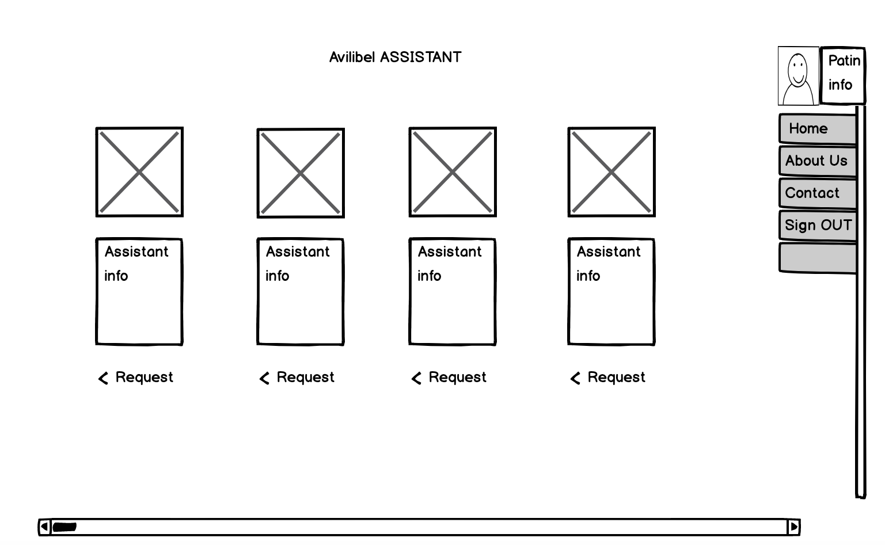
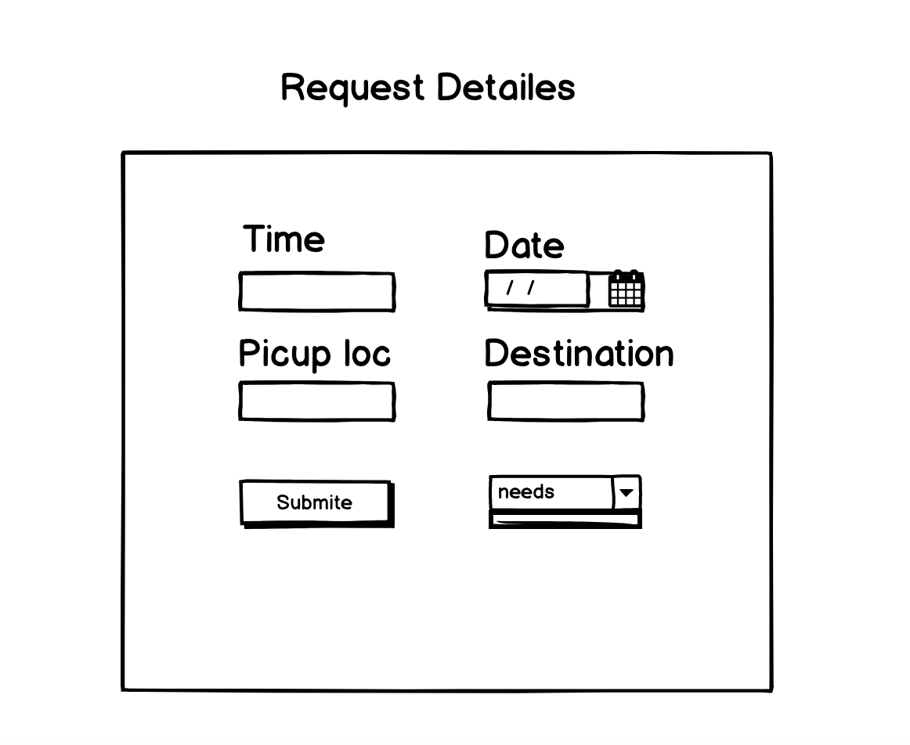
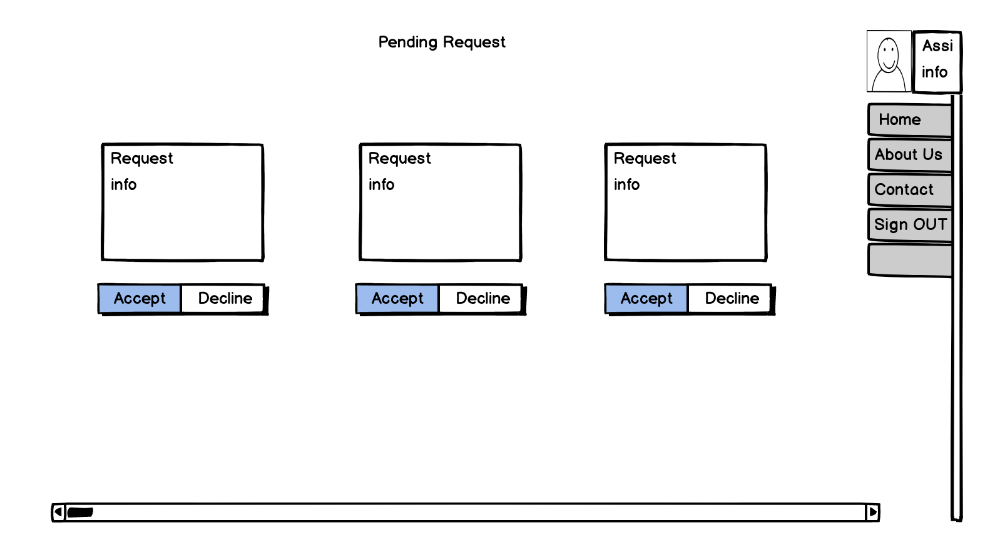
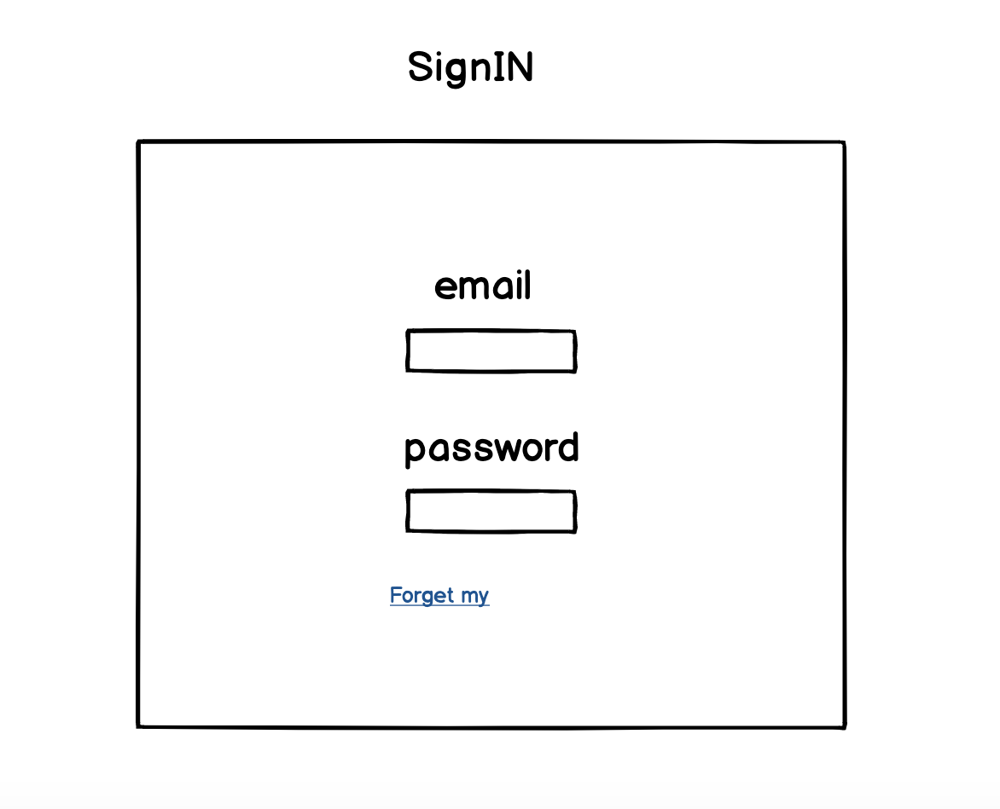
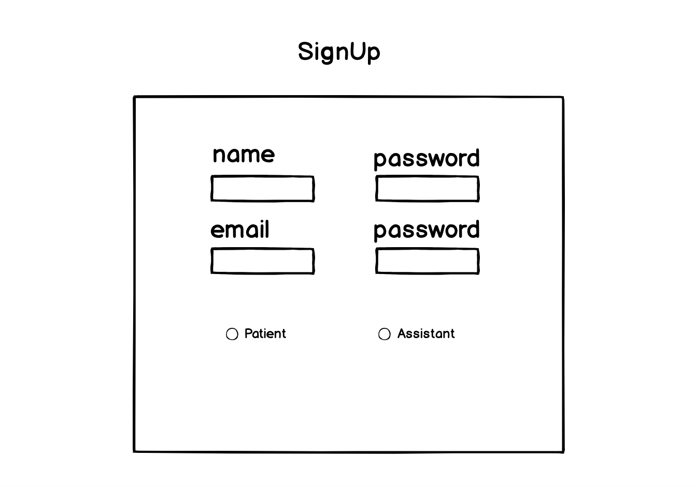
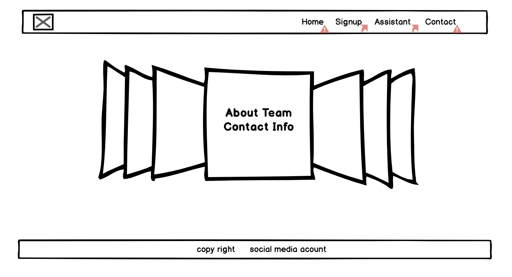

# Meddico Trip backend server

this project is a react project meant to help and connect individuals with special needs with drivers of specially equipped vehicles.

used with Meddico Trip deployed server. 

## Run the Application locally 
- fork and clone the the repo
- run npm install
- npm start

## Libraries Used
- React
- bootstrap
- MDBMedia
- NDB-Material Design
- Axios

## User Story
As Patient:
- As a patient I must create profile 
- As patient I can choose assistants
- As patient I can create request for help provider (assistant)
- As patient I can see(read/show) request for help provider (assistant)
- As patient I can update request for help provider (assistant)
- As patient I can delete request for help provider (assistant)
- As patient I can update my personal info to show my requirement

As assistant:
- As assistant I must create profile approved by IT/admin 
- As assistant I must to fill form with vehicle description and service provided 
- As assistant I received request by patients As assistant I can see the patient requests with detailed info 
- As assistant I can accept patient requests
- As assistant I can decline patient requests

As IT:
- I can assign the role for the user Patient/Assistant
- As IT I can view all the requests History of the patient 

## wireframes and diagrams 

## Future Iterations
- google maps API
- live tracking of assistants
- call through app
- implement a chat bot
- communication between users through application

## Links 
Live deployment link: https://hamjahb.github.io/project-4-frontend/#/

GitHub back end: https://github.com/hamjahb/project4

Github React app:https://github.com/hamjahb/project-4-frontend
 

## project team

### Hisham Aljahbli
[linkedin](https://www.linkedin.com/in/haljahbli-softwareeng/).

[github](https://github.com/hamjahb/).

### Obaid Alqahtani 
[linkedin](https://www.linkedin.com/in/obaid-fpga/).

[github](https://github.com/obal3588).

### Sarah Alghofaili
[linkedin](https://www.linkedin.com/in/sarah-alghofaili-web-designer/).

[github](https://github.com/saera1988).
